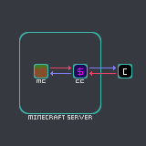
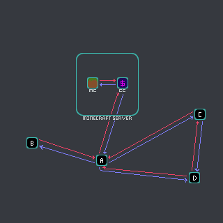

[PREVIOUS PAGE](../../idea.md) | [NEXT PAGE](APIs.md)

Using the ledger's API allows (you/others) to (make/use) connected services that utilize the ledger, below is a visual represenation of connected services:

ideally as the ecosystem develops, connected services become inner connected

the aim of any of these services being to provide some kind of functionality that relies on the ground truth of who has what, this information is centrally secured in CCash.

if you want to browse the currently available services, check out [existing_services.md](../existing_services.md)

to make a connected service yourself you can do so by using one of the [langauge specific APIs](APIs.md), the way they work is by providing a clean in langauge way to interface with the CCash instance

if an API does not exist for your language it is simple to make one, and I encourage you to add it to this list if you do decide to.

while developing make sure to reference the list of [endpoints](endpoints.md)