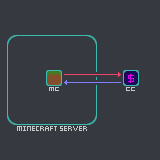
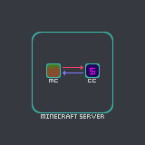

[PREVIOUS PAGE](../README.md) | [NEXT PAGE](connected_services/how_to/explanation.md)

CCash is a web server hosting a ledger for Minecraft, able to be used from anything that can interact with its Restful API, including ComputerCraft. 

the currency model most Minecraft Servers adopt if any, is resource based, usually diamonds, this model is fraught with issues however:

* the primary issue is minecraft worlds are infinite leading to hyper inflation as everyone accrues more diamonds
* there is no central authority minting the currency, any consumer can introduce more diamonds to the system
* some resources are passively reapable, making the generation of currency a larger focus then of products
* locality is required for transaction
* theft is possible, ownership is possession based

CCash solves these issues and adds a level of abstraction, the main philosophy of CCash is to have fast core operations that other services build on

the CCash instance can be external to the minecraft server 

or on localhost:

running it local to the minecraft server reduces latency for ComputerCraft connected services, fortunately CCash is sufficiently lightweight as to not impact performance on most setups.

**DISCLAIMER: if you are to run it locally and want to use ComputerCraft with it, make sure to add `127.0.0.1` to ComputerCraft's config section `allowed_domains`**   \
