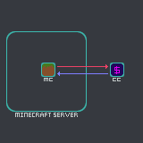

[PREVIOUS PAGE](../README.md) | [NEXT PAGE](connected_services/how_to/explanation.md)

CCash is an external ledger for in-game economies, running on a webserver with a RESTful API, exceptionally fast and lightweight written in C++17.

While CCash can be used for anything that can interact with its API I think minecraft is a good example:

the currency model most Minecraft Servers adopt if any, is resource based, usually diamonds, this model is fraught with issues however:

* the primary issue is minecraft worlds are infinite leading to hyper inflation as everyone accrues more diamonds
* there is no central authority minting the currency, any consumer can introduce more diamonds to the system
* some resources are passively reapable, making the generation of currency a larger focus then of products
* locality is required for transaction
* theft is possible, ownership is possession based

CCash solves these issues and adds a level of abstraction, the main philosophy of CCash is to have fast core operations that other services build on

the CCash instance can be external to the game server 

or on localhost:

running it local to the game server reduces latency for ComputerCraft connected services, fortunately CCash is sufficiently lightweight as to not impact performance on most setups.

**DISCLAIMER: if you are to run it locally and want to use ComputerCraft with it, make sure to add `127.0.0.1` to ComputerCraft's config section `allowed_domains`**   

as CCash is just a means of keeping track of who has what, the economic system you use is self decided, ideally an admin should manage the instance to lower incentive to manipulate as they concievably already have supreme power over the given game.